# KUNJI-PATOL-75% KEYBOARD!

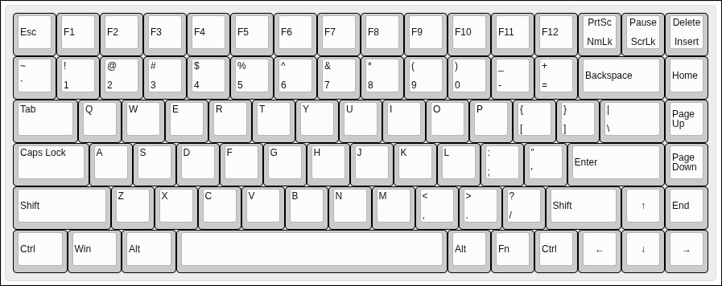

## Overview
a 75%% keyboard design, it is based on RP2040 plus with a type C port which came in-built with the MCU, there total of 87 MX switches with 5 Stabilizers. A complete keyboard :).

## Bit in depth info
The keyboard is designed to be sleek and plane it has RP2040 plus as the MCU and Cherry MX Brown Switches for the keys which are used for versatile purposes (that's what i saw at least). The main firmware is KMK based and the Firmware has already been released, you can find that in the Firmware and Production folder, I hate using different cables so having type c inbuilt in the RP2040 plus is a win-win. I tried to built a unique design but routing diodes was hell, at the end the pcb looks very good in black color, hope you like my project :).

---

## Files to build 

### PCB 

The files for the PCB and Schematics are available in the Kicad folder and gerber files are added in the Production folder..

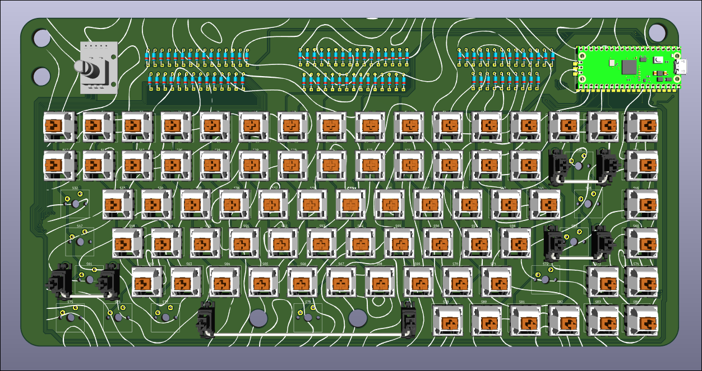

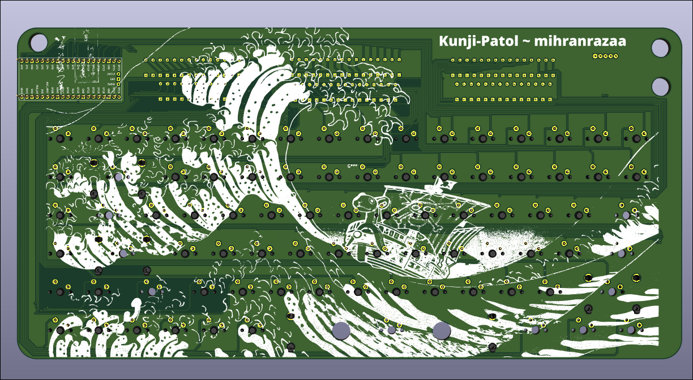

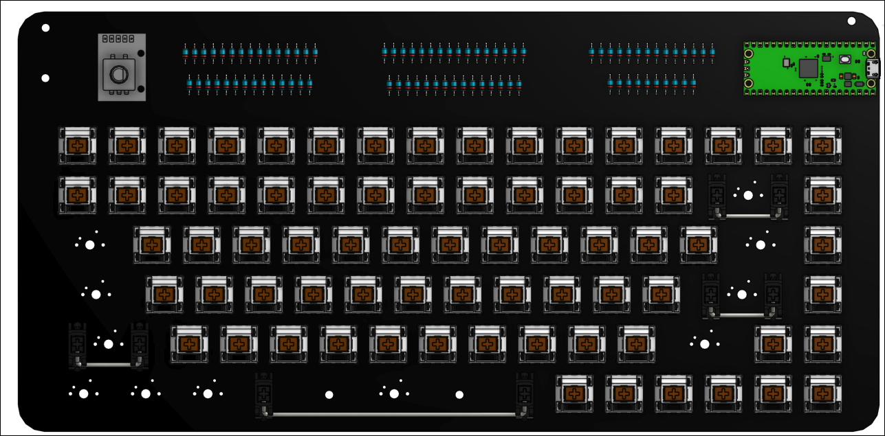

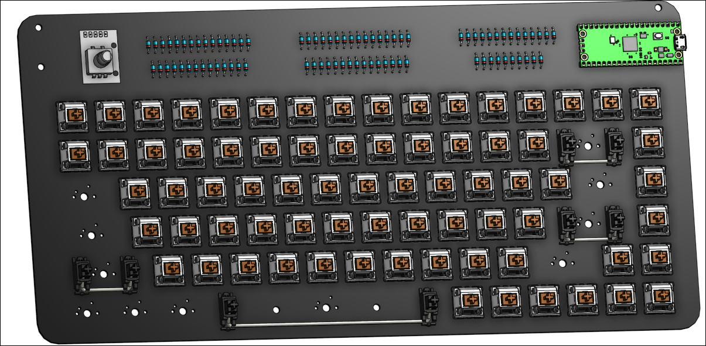

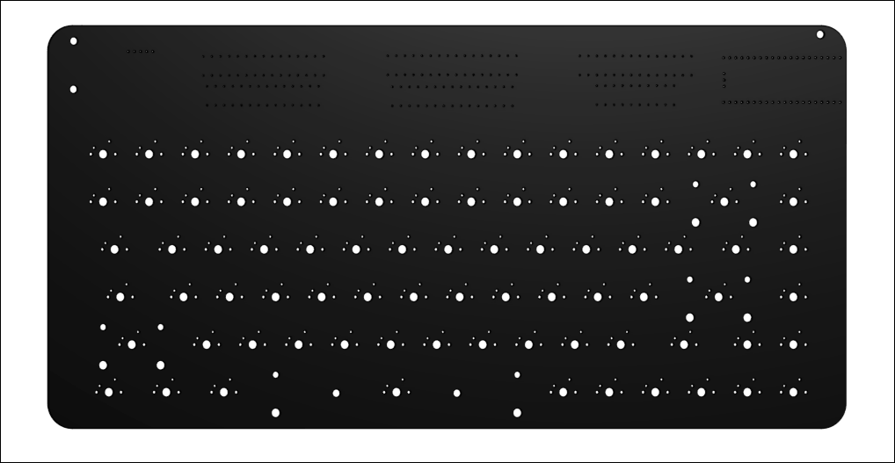

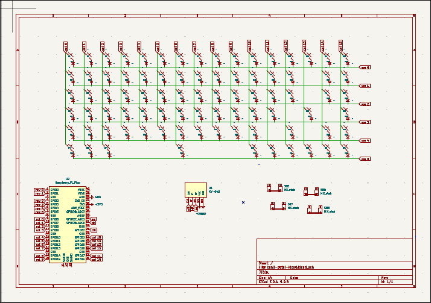

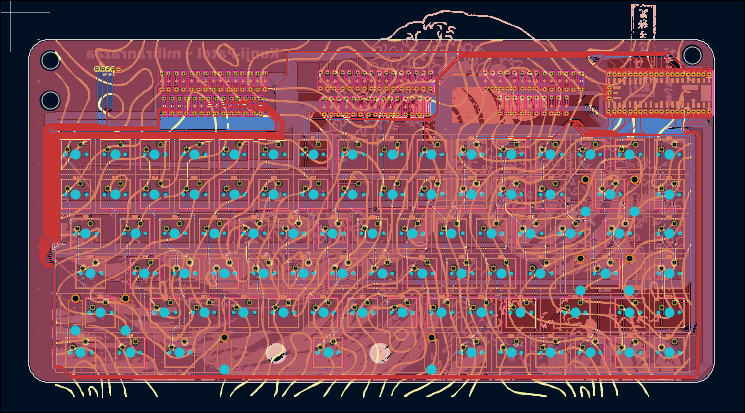

## Images

The files for case and plate cover are available in CAD folder and in production folder, you can also but acrylic sheet for the transparent plate.
Sorry i can't take photos of everything combined due to my potato laptop (it starts baking..)
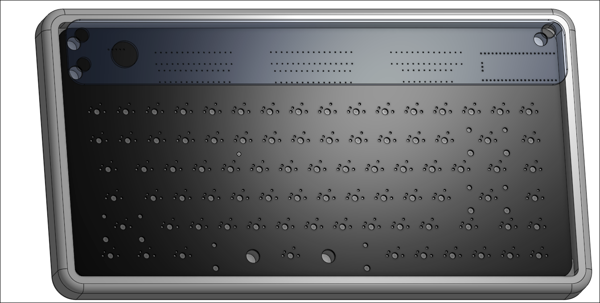

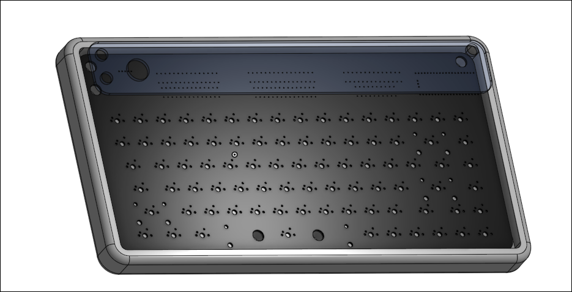

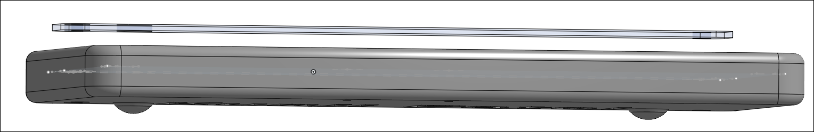

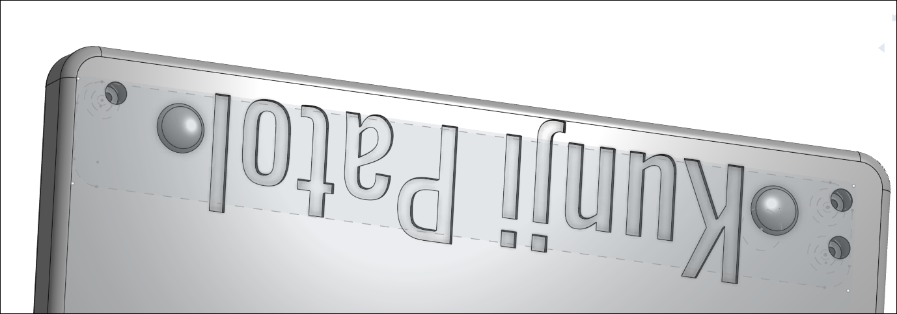

## Zine

Zine PDF is available in Production

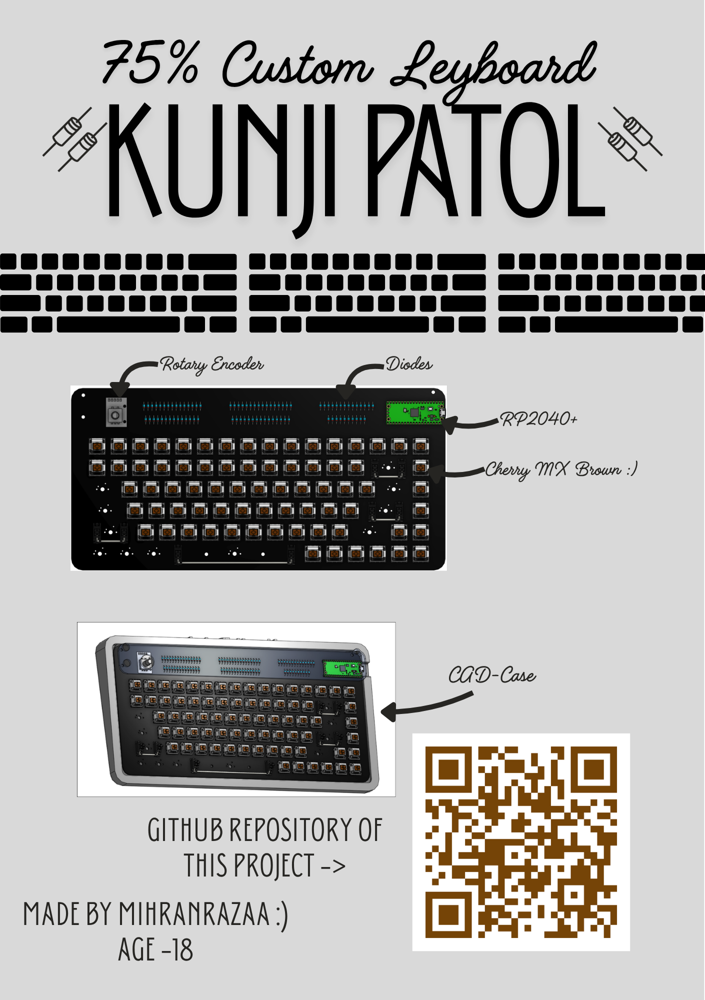

---

---

## BOM

| Component                 | Quantity | Note                                                                                    | Price    | Link                                                                                                                                       |
| ------------------------- | -------- | --------------------------------------------------------------------------------------- | -------- | ------------------------------------------------------------------------------------------------------------------------------------------ |
| Cherry MX Switches(Brown) | 1       | Couldn't find a proper retailer on Amazon.They are selling for the right amount i think, | 32USD    | [Available](https://www.keychron.com/products/cherry-switch-set?variant=39298816835673)                                                    |
| White Keycaps set         | 1        | Good Asthetics are important I will keep the body grey :)                               | 25USD    | [Available](https://www.keychron.com/products/cherry-profile-double-shot-pbt-full-set-keycaps-dolch-red-gray-white-mint-blue-black-yellow) |
| Stabilizer set            | 1        | It has 2 extra Stabilizers just in case..                                               | 20USD    | [Available](https://amzn.in/d/dM157FJ) [Available](https://amzn.in/d/5Nto8PQ)                                                              |
| Case & PCB                | 1        | I will make them through any local business                                             | 15-20USD |                                                                                                                                            |
| TOTAL                     |          |                                                                                         | 100USD   |                                                                                                                                            |

*I have some parts already + M3 screws and heatset inserts are not included as i already have them, one pack of each is more then enough.

---

## End

~ [mihranrazaa](https://mihranrazaa.info/)

BYEEE
